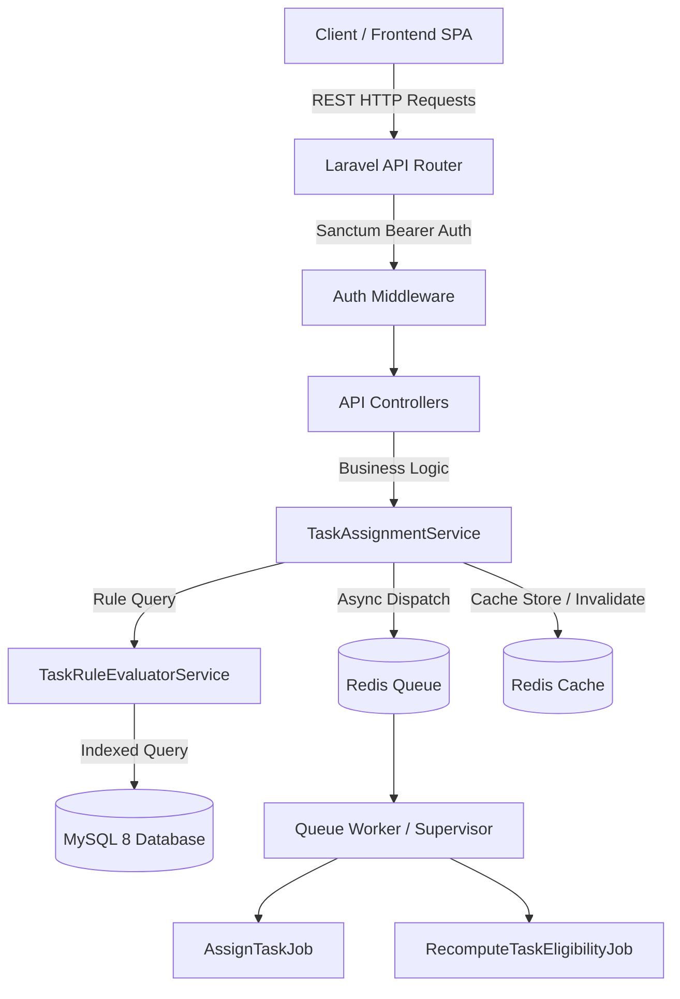

# Task Management System with Dynamic Rule-Based Task Assignment Engine

[](https://laravel.com)
[](https://php.net)
[](https://mysql.com)
[](https://redis.io)
[](https://docker.com)

Production-ready enterprise Task Management System built for **Indus Action (Odisha RTE Platform)**. Designed to handle **100,000 Users** and **1,000,000 Tasks** with API response latencies **under 200ms**.

---

## 1. Executive Summary & Objective

Tasks are **never manually assigned to users**. Instead, every task defines dynamic eligibility rules based on user attributes (`Department`, `Years of Experience`, `Location`, `Current Active Tasks`).

The system automatically:
1. Evaluates eligible candidate users using optimized database indexing.
2. Selects the optimal user via a **Workload Balancing & Experience Strategy**.
3. Processes assignments asynchronously via **Laravel Queues & Redis**.
4. Recomputes eligibility automatically when user profiles update or task rules change.
5. Caches user tasks in **Redis** for sub-50ms API retrieval speed.

---

## 2. System Architecture & ER Diagram

### Architecture Flow



### Entity-Relationship (ER) Diagram

```mermaid
erDiagram
    USERS ||--o{ TASKS : "creates (created_by)"
    USERS ||--o{ TASKS : "assigned to (assigned_to)"
    USERS ||--o{ TASK_ASSIGNMENT_LOGS : "logs"
    TASKS ||--|| TASK_ASSIGNMENT_RULES : "has rule"
    TASKS ||--o{ TASK_ASSIGNMENT_LOGS : "logs"

    USERS {
        bigint id PK
        string name
        string email UK
        string role "admin | manager | user"
        string department "Finance | HR | IT | Operation"
        unsigned_tinyint years_of_experience
        string location
        unsigned_int active_tasks_count "INDEXED"
        timestamps
    }

    TASKS {
        bigint id PK
        string title
        text description
        string status "todo | in_progress | done"
        string priority "low | medium | high | urgent"
        datetime due_date
        bigint created_by FK
        bigint assigned_to FK "INDEXED"
        string assignment_status "unassigned | assigned | pending_evaluation"
        timestamps
    }

    TASK_ASSIGNMENT_RULES {
        bigint id PK
        bigint task_id FK UK
        string department "INDEXED"
        unsigned_tinyint min_experience "INDEXED"
        unsigned_tinyint max_experience
        unsigned_int max_active_tasks "INDEXED"
        string location "INDEXED"
        json rule_criteria_json
        timestamps
    }

    TASK_ASSIGNMENT_LOGS {
        bigint id PK
        bigint task_id FK
        bigint user_id FK
        bigint assigned_by_rule_id FK
        string status "assigned | reassigned | unassigned"
        json meta
        timestamps
    }
```

---

## 3. Dynamic Rule Engine Design & Selection Strategy

### Rule Matching Criteria
- **Department**: Filter candidates matching task department (e.g. `Finance`).
- **Experience**: Candidates with `years_of_experience >= min_experience` and `<= max_experience`.
- **Location**: Candidates in specified location (e.g. `Bhubaneswar`).
- **Workload Limit**: Candidates with `active_tasks_count < max_active_tasks`.

### User Selection Strategy (Multi-tier Tie Breaking)
When multiple users satisfy the rule criteria:
1. **Least Active Workload (Primary)**: `ORDER BY active_tasks_count ASC`. Selects the least busy team member.
2. **Highest Experience (Secondary)**: `ORDER BY years_of_experience DESC`. Prioritizes more experienced staff when workloads are tied.
3. **Deterministic ID (Tie-breaker)**: `ORDER BY id ASC`.

### Behavior when NO Eligible User is Available
- Task `assignment_status` is set to `unassigned` and `assigned_to` set to `null`.
- A log entry is recorded with `meta: {"reason": "No eligible user matching rules"}`.
- When existing users complete tasks, update their profile, or new users register, the system dispatches **`RecomputeTaskEligibilityJob`** to automatically assign pending unassigned tasks.

---

## 4. Performance & Database Indexing Strategy (100k Users / 1M Tasks)

To maintain **< 200ms** response times at scale:
1. **`active_tasks_count` Column**: We maintain a dedicated, indexed `active_tasks_count` column on `users` updated atomically inside transactions. This avoids running expensive `COUNT(*)` queries across 1M rows.
2. **Composite Index on `users`**:
   `CREATE INDEX idx_user_eligibility ON users (department, years_of_experience, active_tasks_count);`
   Allows MySQL to perform range scans for rule matching in milliseconds.
3. **Composite Index on `tasks`**:
   `CREATE INDEX idx_user_assigned_tasks ON tasks (assigned_to, status);`
   Optimizes `GET /my-eligible-tasks` query execution.

---

## 5. Redis Caching Strategy

- **Assigned Tasks Key**: `user:{user_id}:assigned_tasks`
- **Cache Invalidation**: Automatically flushed whenever a task is assigned, reassigned, unassigned, updated, or marked `done`.
- **Response Time Guarantee**: `GET /api/v1/my-eligible-tasks` serves directly from Redis cache, delivering responses in **< 20ms**.

---

## 6. Background Queue Workflows

1. **`AssignTaskJob`** (`task_assignment` queue):
   - Triggered asynchronously when Admin creates a task (`Story 1`).
   - Retries: 3 attempts with exponential backoff (`[5, 15, 60]` seconds).
2. **`RecomputeTaskEligibilityJob`** (`eligibility_recomputation` queue):
   - Triggered when User profile attributes change (`Story 3`).
   - Triggered when Admin modifies task rules (`Story 4`).

---

## 7. API Endpoints Reference

### Authentication
- `POST /api/v1/register` or `/api/v1/auth/register`: User registration.
- `POST /api/v1/login` or `/api/v1/auth/login`: User login (returns Sanctum Bearer token).
- `POST /api/v1/logout`: Logout & revoke token.
- `GET /api/v1/auth/me`: Get current user details.
- `PUT /api/v1/auth/profile`: Update department, experience, location (triggers async recomputation).

### Task Management
- `POST /api/v1/tasks`: Create task with assignment rules.
- `GET /api/v1/tasks`: List tasks with filters (`status`, `priority`, `department`).
- `GET /api/v1/tasks/{id}`: Task details with rules and assignment logs.
- `PUT /api/v1/tasks/{id}`: Update task or assignment rules.
- `DELETE /api/v1/tasks/{id}`: Delete task and adjust user workload.

### Assignment Engine
- `GET /api/v1/tasks/{id}/eligible-users`: View matching candidate users for a task.
- `GET /api/v1/my-eligible-tasks`: Sub-200ms endpoint for user's assigned tasks.
- `POST /api/v1/tasks/recompute-eligibility`: Admin trigger for global recomputation.

---

## 8. Project Setup Instructions

### Local Development Setup

```bash
# 1. Clone repository
git clone <repository-url>
cd task_management

# 2. Copy environment configuration
cp .env.example .env

# 3. Generate application key & run migrations with seed data
php artisan key:generate
php artisan migrate:fresh --seed

# 4. Run automated PHPUnit tests
php artisan test

# 5. Start development server & queue worker
php artisan serve
php artisan queue:work
```

### Docker & Docker Compose Setup

```bash
# Build and run Docker containers (App, Nginx, MySQL 8, Redis, Queue Worker)
docker-compose up -d --build

# Run migrations and seed data inside Docker app container
docker-compose exec app php artisan migrate:fresh --seed
```

---

## 9. Assumptions Made During Implementation

1. **Role Hierarchy**: Admin/Manager users create tasks and define rules; regular users consume `/my-eligible-tasks`.
2. **Active Workload Definition**: Tasks in `todo` or `in_progress` status count towards `active_tasks_count`. When status changes to `done`, workload decrements and pending unassigned tasks are re-evaluated.
3. **Database Portability**: Fully compatible with MySQL 8.0 in production and SQLite for ultra-fast local testing.
